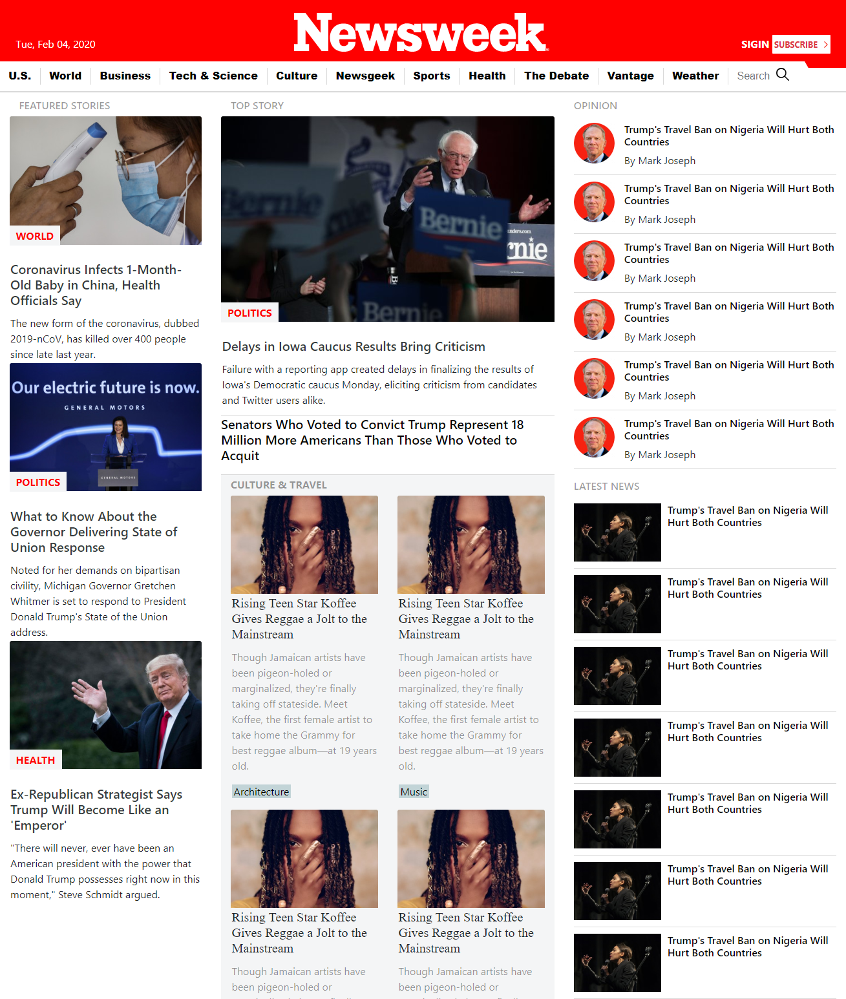

# Embedding Images and Video

> This project consists of building an HTML document that matches the appearance of youtube.

Use of vectors of the icon on youtube with css and all of the page it's responsive.

## Built With

- HTML5, CSS.

## Live Demo

[Live Demo Link](https://abdelp.github.io/video-player/)

## Authors

👤 **Abdel Pérez**

- Github: [@abdelp](https://github.com/abdelp/)
- Twitter: [@AbdelPerez11](https://twitter.com/abdelperez11)
- Linkedin: [Abdel Pérez](https://www.linkedin.com/in/abdel-p%C3%A9rez-t%C3%A9llez-72b2aa153/)

👤 **Angel Benjamin Cussi**

- Github: [@abcussi](https://github.com/abcussi)
- Twitter: [@thecussi](https://twitter.com/thecussi)
- Linkedin: [Angel Cussi](https://www.linkedin.com/in/angel-cussi-1b2310174/)

## 🤝 Contributing

Contributions, issues and feature requests are welcome!

Feel free to check the [issues page](https://github.com/abdelp/video-player/issues).

## Show your support

Give a ⭐️ if you like this project!

## 📝 License

This project is [MIT](lic.url) licensed.
